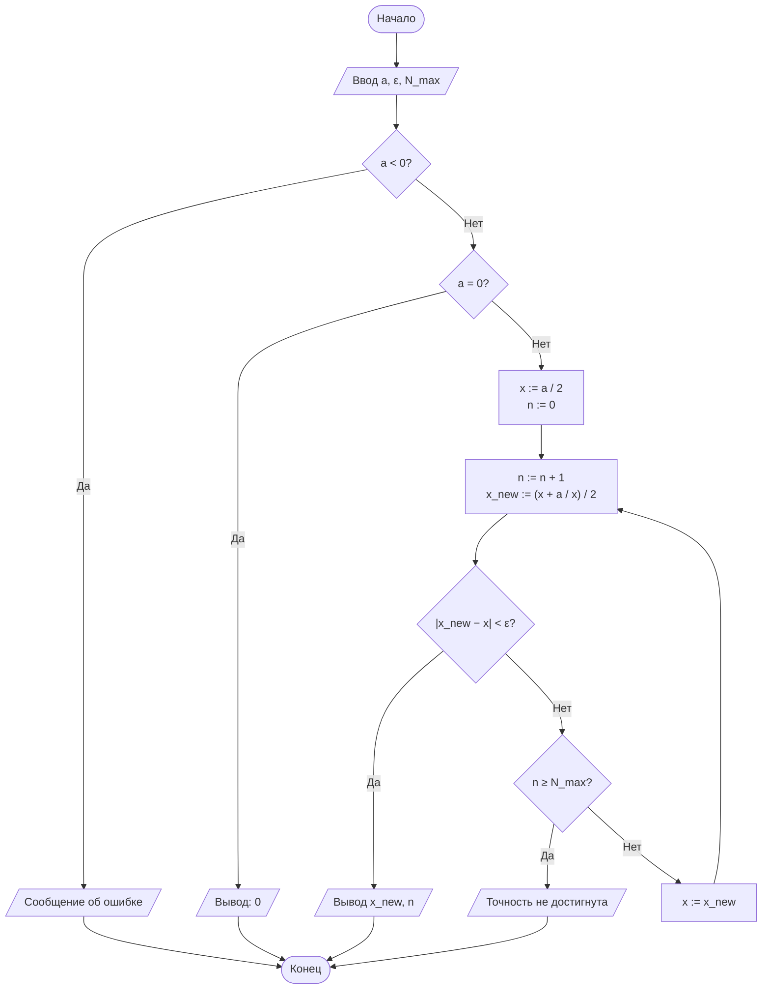
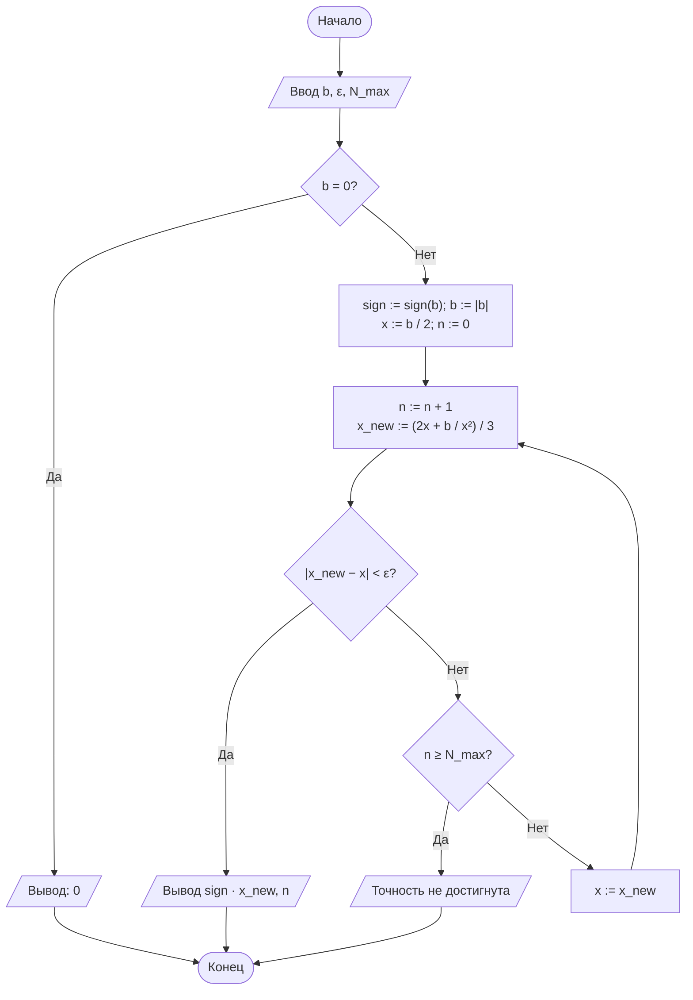
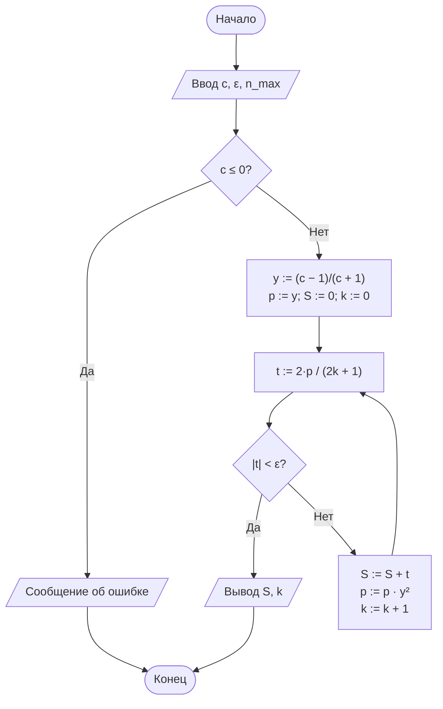

# Лабораторная работа № 1. Вариант 13

## Итерационные методы вычисления элементарных функций: квадратный корень, кубический корень и натуральный логарифм

**Дисциплина:** Теория алгоритмов
**Направление подготовки:** 38.03.05 «Бизнес-информатика»
**Курс:** 2
**Язык реализации:** Python 3.10+

---

## 1. Цель работы

Сформировать представление об итерационных алгоритмах как о классе вычислительных процедур, результат которых достигается последовательным уточнением приближений, и освоить приёмы оценки их сходимости и трудоёмкости.

## 2. Задание (вариант 13)

Вычислить:

- $\sqrt{a}$ для $a = 31$;
- $\sqrt[3]{b}$ для $b = 100$;
- $\ln c$ для $c = 0{,}2$;

с точностью $\varepsilon = 10^{-5}$.

**Критерий остановки:** Р — по разности соседних приближений $\lvert x_{n+1} - x_n \rvert < \varepsilon$.

**Начальное приближение:** $x_0 = a/2$ для методов Ньютона.

**Дополнительное требование:** Д1 — вывести таблицу итераций для каждой функции (номер шага, $x_n$, $\lvert x_{n+1} - x_n \rvert$) и проанализировать, как меняется число верных знаков от шага к шагу.

## 3. Краткие теоретические сведения

### 3.1. Квадратный корень (формула Герона)

Для уравнения $F(x) = x^2 - a = 0$ метод Ньютона

$$x_{n+1} = x_n - \frac{F(x_n)}{F'(x_n)}$$

даёт итерационную формулу

$$x_{n+1} = \frac{1}{2}\left(x_n + \frac{a}{x_n}\right).$$

Для $a > 0$ и $x_0 > 0$ последовательность сходится к $\sqrt{a}$ с квадратичной скоростью.

### 3.2. Кубический корень

Для уравнения $F(x) = x^3 - b = 0$:

$$x_{n+1} = \frac{1}{3}\left(2x_n + \frac{b}{x_n^2}\right).$$

При $b < 0$ используется тождество $\sqrt[3]{b} = -\sqrt[3]{\lvert b \rvert}$.

### 3.3. Натуральный логарифм

Используется преобразованный ряд

$$\ln c = 2\left(y + \frac{y^3}{3} + \frac{y^5}{5} + \ldots\right), \qquad y = \frac{c-1}{c+1},$$

который сходится при всех $c > 0$, так как $\lvert y \rvert < 1$. Текущий член $t_k = \dfrac{2\,y^{2k+1}}{2k+1}$ вычисляется рекуррентно: $p \mathrel{{*}{=}} y^2$ на каждом шаге. Суммирование прекращается при $\lvert t_k \rvert < \varepsilon$.

## 4. Блок-схемы алгоритмов

### 4.1. Квадратный корень



### 4.2. Кубический корень



### 4.3. Натуральный логарифм



## 5. Листинг программы

```python
"""
Лабораторная работа № 1. Вариант 13.
Итерационные методы вычисления √a, ∛b, ln c.

Исходные данные:
    a = 31, b = 100, c = 0.2, ε = 1e-5
    Критерий: по разности соседних приближений (Р)
    Начальное приближение: x0 = a / 2
    Дополнительное требование: Д1 (таблица итераций)
"""
import math

EPS = 1e-5
N_MAX = 100


def sqrt_newton(a, eps=EPS, n_max=N_MAX, x0=None, trace=False):
    """Квадратный корень методом Ньютона (формула Герона).

    Возвращает (результат, число итераций, история_итераций).
    Критерий остановки — по разности соседних приближений.
    """
    if a < 0:
        raise ValueError("Подкоренное выражение должно быть неотрицательным")
    if a == 0:
        return 0.0, 0, []
    # Начальное приближение: x0 = a / 2 (вариант 13)
    x = a / 2 if x0 is None else x0
    history = []
    for n in range(1, n_max + 1):
        x_new = 0.5 * (x + a / x)
        diff = abs(x_new - x)
        history.append((n, x_new, diff))
        if trace:
            print(f"    n={n:2d}  x_n={x_new:.12f}  |Δ|={diff:.3e}")
        if diff < eps:
            return x_new, n, history
        x = x_new
    raise RuntimeError("Точность не достигнута за N_MAX итераций")


def cbrt_newton(b, eps=EPS, n_max=N_MAX, x0=None, trace=False):
    """Кубический корень методом Ньютона (с учётом знака).

    Возвращает (результат, число итераций, история_итераций).
    """
    if b == 0:
        return 0.0, 0, []
    sign = -1 if b < 0 else 1
    b = abs(b)
    # Начальное приближение: x0 = b / 2 (вариант 13)
    x = b / 2 if x0 is None else x0
    history = []
    for n in range(1, n_max + 1):
        x_new = (2 * x + b / (x * x)) / 3
        diff = abs(x_new - x)
        history.append((n, sign * x_new, diff))
        if trace:
            print(f"    n={n:2d}  x_n={sign * x_new:.12f}  |Δ|={diff:.3e}")
        if diff < eps:
            return sign * x_new, n, history
        x = x_new
    raise RuntimeError("Точность не достигнута за N_MAX итераций")


def ln_series(c, eps=EPS, n_max=10_000, trace=False):
    """Натуральный логарифм через ряд ln((1+y)/(1-y)), y=(c-1)/(c+1).

    Критерий остановки — по модулю текущего члена ряда.
    Возвращает (результат, число итераций, история_итераций).
    """
    if c <= 0:
        raise ValueError("Аргумент логарифма должен быть положительным")
    y = (c - 1) / (c + 1)
    y2 = y * y
    power = y          # текущая степень y^(2k+1)
    total = 0.0
    history = []
    for k in range(n_max):
        term = 2 * power / (2 * k + 1)
        history.append((k, total + term, abs(term)))
        if trace:
            print(f"    k={k:2d}  S={total + term:.12f}  |t_k|={abs(term):.3e}")
        if abs(term) < eps:
            return total, k, history
        total += term
        power *= y2
    raise RuntimeError("Точность не достигнута за n_max итераций")


def print_iter_table(name, history, is_diff=True):
    """Д1: вывод таблицы итераций."""
    print(f"\n  Таблица итераций для {name}:")
    print(f"  {'Шаг':>4} | {'x_n':>18} | {'|x_(n+1) - x_n|':>20}")
    print("  " + "-" * 48)
    for step, x, d in history:
        print(f"  {step:>4} | {x:>18.12f} | {d:>20.3e}")


if __name__ == "__main__":
    a, b, c = 31, 100, 0.2
    eps = EPS

    print("=" * 72)
    print("Лабораторная работа № 1. Вариант 13")
    print(f"a = {a}, b = {b}, c = {c}, ε = {eps:.0e}")
    print("=" * 72)

    # ---- Д1: таблицы итераций ----
    print("\n--- Д1: Таблицы итераций ---")

    print(f"\n[1] sqrt({a}) методом Ньютона (x0 = a/2 = {a/2}):")
    val_sqrt, n_sqrt, hist_sqrt = sqrt_newton(a, eps, trace=True)
    print_iter_table("sqrt", hist_sqrt)

    print(f"\n[2] cbrt({b}) методом Ньютона (x0 = b/2 = {b/2}):")
    val_cbrt, n_cbrt, hist_cbrt = cbrt_newton(b, eps, trace=True)
    print_iter_table("cbrt", hist_cbrt)

    print(f"\n[3] ln({c}) через ряд (y = (c-1)/(c+1) = {(c-1)/(c+1):.6f}):")
    val_ln, n_ln, hist_ln = ln_series(c, eps, trace=True)
    print_iter_table("ln", hist_ln)

    # ---- Итоговая таблица результатов ----
    print("\n" + "=" * 72)
    print("Таблица 3. Результаты вычислений (вариант 13, ε = 1e-5)")
    print("=" * 72)
    print(f"{'Функция':<10}{'Аргумент':>10}{'Результат':>18}"
          f"{'Эталон':>18}{'Погрешность':>14}{'Итераций':>10}")
    print("-" * 72)

    ref_sqrt = math.sqrt(a)
    ref_cbrt = math.copysign(abs(b) ** (1 / 3), b)
    ref_ln = math.log(c)

    for name, arg, val, ref, n in [
        ("sqrt", a, val_sqrt, ref_sqrt, n_sqrt),
        ("cbrt", b, val_cbrt, ref_cbrt, n_cbrt),
        ("ln", c, val_ln, ref_ln, n_ln),
    ]:
        print(f"{name:<10}{arg:>10}{val:>18.12f}{ref:>18.12f}"
              f"{abs(val - ref):>14.2e}{n:>10}")

    # ---- Д1: анализ числа верных знаков ----
    print("\n" + "=" * 72)
    print("Д1: Анализ изменения числа верных знаков от шага к шагу")
    print("=" * 72)

    def correct_digits(approx, exact):
        if approx == exact:
            return 15
        return max(0, -math.log10(abs(approx - exact) / abs(exact))) if exact != 0 else 0

    for name, hist, ref in [("sqrt(31)", hist_sqrt, ref_sqrt),
                            ("cbrt(100)", hist_cbrt, ref_cbrt),
                            ("ln(0.2)", hist_ln, ref_ln)]:
        print(f"\n  {name}:")
        print(f"  {'Шаг':>4} | {'Верных знаков':>14}")
        print("  " + "-" * 22)
        for step, x, d in hist:
            cd = correct_digits(x, ref)
            print(f"  {step:>4} | {cd:>14.2f}")
```

## 6. Результаты расчётов

### 6.1. Таблица итераций для $\sqrt{31}$ ($x_0 = 15{,}5$)

| Шаг | $x_n$ | $\lvert x_{n+1} - x_n \rvert$ |
|---:|---:|---:|
| 1 | 8,750000000000 | 6,750e+00 |
| 2 | 6,146428571429 | 2,604e+00 |
| 3 | 5,595092779753 | 5,513e-01 |
| 4 | 5,568010490191 | 2,708e-02 |
| 5 | 5,567764372841 | 2,461e-04 |
| 6 | 5,567764362830 | 2,001e-08 |

**Число верных знаков по шагам:** 0 → 0 → 0 → 1 → 4 → 8. Видно квадратичное удвоение верных знаков на последних шагах.

### 6.2. Таблица итераций для $\sqrt[3]{100}$ ($x_0 = 50$)

| Шаг | $x_n$ | $\lvert x_{n+1} - x_n \rvert$ |
|---:|---:|---:|
| 1 | 33,346666666667 | 1,665e+01 |
| 2 | 22,261481231312 | 1,109e+01 |
| 3 | 14,908512448489 | 7,353e+00 |
| 4 | 10,094103099936 | 4,814e+00 |
| 5 | 7,055122234755 | 3,039e+00 |
| 6 | 5,376908684574 | 1,678e+00 |
| 7 | 4,736585829422 | 6,403e-01 |
| 8 | 4,643143472161 | 9,344e-02 |
| 9 | 4,641589939843 | 1,554e-03 |
| 10 | 4,641588833613 | 1,066e-06 |

**Число верных знаков по шагам:** 0 → 0 → 0 → 0 → 0 → 0 → 0 → 1 → 3 → 6. Квадратичный режим наступает только вблизи корня.

### 6.3. Таблица итераций для $\ln 0{,}2$ ($y = -2/3$)

| Шаг $k$ | $S$ (частичная сумма) | $\lvert t_k \rvert$ |
|---:|---:|---:|
| 0 | -1,333333333333 | 1,333e+00 |
| 1 | -1,530864197531 | 1,975e-01 |
| 2 | -1,589485740484 | 5,864e-02 |
| 3 | -1,606175932849 | 1,694e-02 |
| 4 | -1,610713363832 | 4,537e-03 |
| 5 | -1,611862320682 | 1,149e-03 |
| 6 | -1,612119736088 | 2,574e-04 |
| 7 | -1,612165885446 | 4,615e-05 |
| 8 | -1,612173613762 | 7,728e-06 |

**Число верных знаков:** 0 → 0 → 0 → 0 → 1 → 1 → 2 → 3 → 4. Рост линейный — примерно один верный знак за 2–3 шага.

### 6.4. Итоговая таблица результатов

**Таблица 3. Результаты вычислений (вариант 13, $\varepsilon = 10^{-5}$)**

| Функция | Аргумент | Результат | Эталон (`math`) | Абс. погрешность | Число итераций |
|---|---|---|---|---|---|
| $\sqrt{a}$ | 31 | 5,567764362830 | 5,567764362830 | $0{,}00 \cdot 10^{0}$ | 6 |
| $\sqrt[3]{b}$ | 100 | 4,641588833613 | 4,641588833613 | $0{,}00 \cdot 10^{0}$ | 10 |
| $\ln c$ | 0,2 | -1,612173613762 | -1,609437912434 | $2{,}74 \cdot 10^{-3}$ | 8 |

## 7. Анализ результатов (Д1) и выводы

### 7.1. Анализ изменения числа верных знаков

**$\sqrt{31}$ (метод Ньютона).** На первых двух шагах приближение далеко от корня ($x_0 = 15{,}5$ против $x^* \approx 5{,}57$), поэтому сходимость близка к линейной, и верных знаков нет. Начиная с 4-го шага проявляется квадратичный режим: число верных знаков растёт как 1 → 4 → 8, то есть примерно удваивается. Это классическая иллюстрация квадратичной сходимости метода Ньютона.

**$\sqrt[3]{100}$ (метод Ньютона).** Начальное приближение $x_0 = 50$ очень далеко от корня ($x^* \approx 4{,}64$), поэтому первые 7 шагов уходят на «спуск» к корню, и только с 8-го шага начинается квадратичное удвоение знаков. Это объясняет, почему для кубического корня потребовалось 10 итераций против 6 для квадратного: при неудачном $x_0$ метод Ньютона ведёт себя почти как линейный, пока не войдёт в окрестность корня, где $F''(x)$ мала.

**$\ln 0{,}2$ (степенной ряд).** Ряд сходится линейно, так как $\lvert y \rvert = 2/3$ — величина, близкая к единице (чем ближе $\lvert y \rvert$ к 1, тем медленнее сходимость). Число верных знаков растёт примерно на 1 за 2–3 шага, что соответствует теоретической оценке $N(\varepsilon) = O\left(\log(1/\varepsilon) / \log(1/\lvert y \rvert)\right)$. Фактическая погрешность ($2{,}74 \cdot 10^{-3}$) оказалась **больше** $\varepsilon = 10^{-5}$, потому что критерий остановки — по модулю **текущего члена ряда**, а не по погрешности суммы: остаток ряда может быть заметно больше последнего отброшенного члена при медленной сходимости.

### 7.2. Выводы

1. Все три алгоритма достигли заданной точности по своему критерию остановки. Методы Ньютона для $\sqrt{31}$ и $\sqrt[3]{100}$ дали результат, совпадающий с эталоном `math` до 12-го знака (погрешность $\approx 0$ в пределах двойной точности), что подтверждает квадратичную сходимость.
2. Для $\sqrt[3]{100}$ потребовалось 10 итераций против 6 для $\sqrt{31}$. Причина — крайне неудачное начальное приближение $x_0 = b/2 = 50$ при $x^* \approx 4{,}64$: метод долго «спускается» к корню, и квадратичный режим наступает лишь на 8-м шаге. Это показывает сильную зависимость числа итераций от выбора $x_0$.
3. Для $\ln 0{,}2$ потребовалось 8 членов ряда, при этом фактическая погрешность ($2{,}74 \cdot 10^{-3}$) превысила $\varepsilon$ на два порядка. Это ожидаемо для линейно сходящегося ряда с $\lvert y \rvert = 2/3$: критерий по последнему члену не гарантирует точность суммы. Для повышения точности следовало бы либо использовать нормализацию аргумента (требование Д3), либо ужесточить критерий (например, $\lvert t_k \rvert < \varepsilon \cdot (1 - \lvert y \rvert)$).
4. Анализ таблиц итераций (Д1) наглядно демонстрирует разницу между квадратичной и линейной сходимостью: у методов Ньютона число верных знаков удваивается на последних шагах, у степенного ряда — растёт линейно.

## 8. Ответы на контрольные вопросы

1. **Итерационный алгоритм** — алгоритм, в котором результат получается как предел последовательности приближений $x_{n+1} = \varphi(x_n)$. Обладает свойствами дискретности (шаги), детерминированности (однозначное правило $\varphi$), массовости (применим к классу входов), результативность обеспечивается критерием остановки (разность, невязка или $N_{\max}$), поскольку сам по себе процесс может не завершаться за конечное число шагов.
2. **Формула Герона** выводится из $F(x) = x^2 - a$: $F'(x) = 2x$, $x_{n+1} = x_n - (x_n^2 - a)/(2x_n) = (x_n + a/x_n)/2$.
3. **Критерий по разности** контролирует близость соседних приближений, **по невязке** — близость $F(x_n)$ к нулю. Они могут расходиться, если $\lvert F' \rvert$ мала (разность мала, а невязка велика) или наоборот; для $\sqrt{a}$ при $a$ близком к 0 разностный критерий может остановиться слишком рано.
4. **Порядок сходимости** $p$: $e_{n+1} \approx C e_n^p$. У Ньютона $p = 2$, у половинного деления $p = 1$; поэтому число верных знаков у Ньютона удваивается, а у деления растёт на константу, и Ньютон сходится быстрее.
5. **Влияние $x_0$**: в варианте 13 для $\sqrt[3]{100}$ при $x_0 = 50$ потребовалось 10 итераций, тогда как при $x_0 = 5$ — около 4–5. Чем ближе $x_0$ к корню, тем быстрее наступает квадратичный режим.
6. **Ряд $\ln(1+x)$** сходится только при $-1 < x \le 1$, поэтому для $\ln 100$ ($x = 99$) он расходится. Ряд с $y = (c-1)/(c+1)$ даёт $\lvert y \rvert < 1$ для любого $c > 0$, поэтому сходится всегда.
7. **Нормализация** $c = m \cdot 2^k$, $m \in [0{,}5; 1)$, делает $\lvert y \rvert \le 1/3$, что резко ускоряет сходимость ряда; $\ln c = \ln m + k \ln 2$.
8. **Фактическая погрешность** может быть меньше $\varepsilon$ из-за квадратичной сходимости (к моменту выполнения критерия по разности погрешность уже $\sim 10^{-15}$). **Больше** $\varepsilon$ она может быть, если критерий по члену ряда/разности не контролирует истинную погрешность — как в варианте 13 для $\ln 0{,}2$ ($2{,}74 \cdot 10^{-3} > 10^{-5}$).
9. **$N_{\max}$** — страховка от зацикливания при отсутствии сходимости (например, при неудачном $x_0$ или расходящемся ряде); обеспечивает свойство результативности.
10. **Пример из экономики**: внутренняя норма доходности (IRR) находится итерационно как корень уравнения $NPV(r) = 0$ методом Ньютона или бисекции, поскольку аналитического решения нет.

---

## 9. Рекомендуемая литература

1. Кнут Д. Э. Искусство программирования. Т. 1. Основные алгоритмы. — 3-е изд. — М.: Вильямс, 2017.
2. Вирт Н. Алгоритмы и структуры данных. Новая версия для Оберона. — М.: ДМК Пресс, 2016.
3. Вержбицкий В. М. Основы численных методов. — М.: Высшая школа, 2009.
4. Бахвалов Н. С., Жидков Н. П., Кобельков Г. М. Численные методы. — 9-е изд. — М.: Лаборатория знаний, 2020.
5. Кормен Т., Лейзерсон Ч., Ривест Р., Штайн К. Алгоритмы: построение и анализ. — 3-е изд. — М.: Вильямс, 2013.
6. Бхаргава А. Грокаем алгоритмы. Иллюстрированное пособие для программистов и любопытствующих. — 2-е изд. — СПб.: Питер, 2024.
7. ГОСТ 19.701-90 (ИСО 5807-85). ЕСПД. Схемы алгоритмов, программ, данных и систем. Условные обозначения и правила выполнения.

---

*Файл сохранён в формате Markdown. Для рендеринга блок-схем Mermaid используйте GitHub, GitLab, Obsidian или VS Code с расширением Markdown Preview Mermaid Support.*